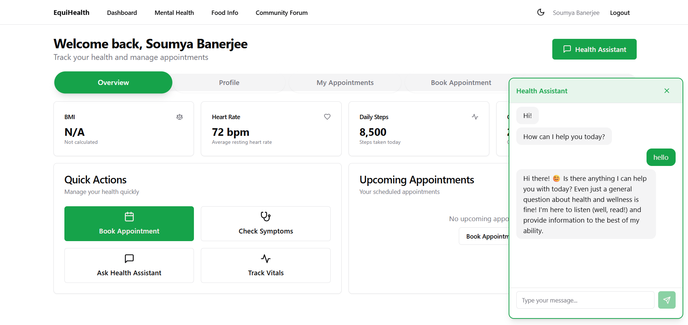
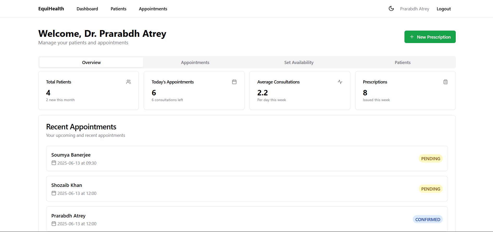
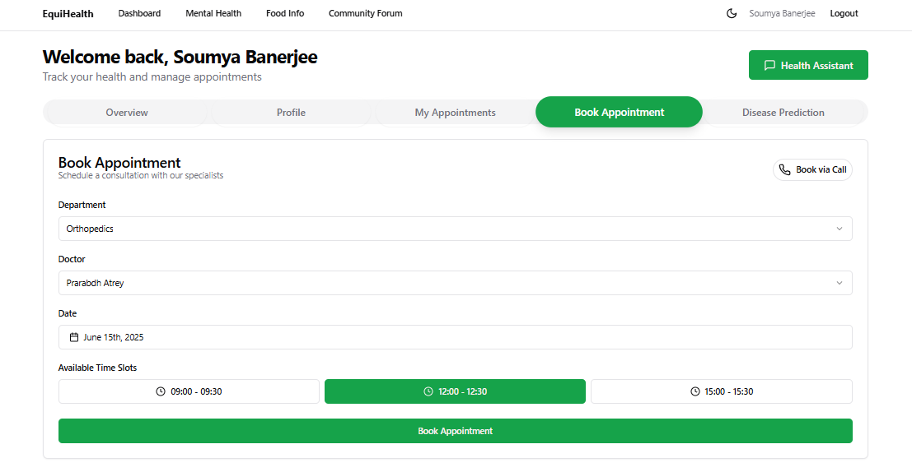
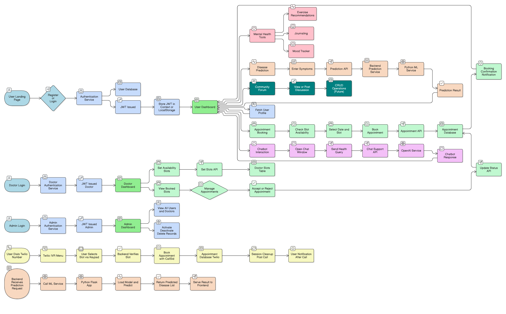

# EquiHealth - Healthcare Disease Prediction Platform

## Overview

EquiHealth is a comprehensive healthcare platform that combines modern web technologies with machine learning to predict and manage diseases. The system serves different user roles including patients, doctors, and administrators, providing tailored experiences for each.

## MVP Screenshots

### Landing Page


### User Dashboard


### Doctor Dashboard


### Appointment Booking Interface


## Architecture Diagram


## Process Flow Diagram



## Features

### Technical Features

| Category | Feature | Description |
|----------|---------|-------------|
| Frontend | React + TypeScript | Modern, type-safe UI development |
| | Vite | Fast development and build tooling |
| | Tailwind CSS | Utility-first CSS framework |
| | React Router | Client-side routing |
| | Context API | State management |
| Backend | Hono.js | Fast, lightweight web framework |
| | Prisma ORM | Type-safe database operations |
| | JWT Auth | Secure authentication |
| | REST API | Standard API architecture |
| ML Module | Python | Core ML implementation |
| | Jupyter | Model development environment |
| | Disease Prediction | ML-based symptom analysis |

### User Features

- **User Authentication and Role Management**
  - Secure login and registration
  - Role-based access control
  - JWT-based session management

- **Disease Prediction**
  - ML-based symptom analysis
  - Real-time predictions
  - Historical prediction tracking

- **Patient Dashboard**
  - Health information tracking
  - Appointment management
  - Doctor communication
  - Prediction history

- **Doctor Dashboard**
  - Patient management
  - Case review system
  - Appointment scheduling
  - Medical advice provision

- **Admin Dashboard**
  - User management
  - System monitoring
  - Content management
  - Analytics dashboard

## Project Structure

```
EquiHealth/
├── frontend/                 # React + TypeScript frontend
│   ├── src/
│   │   ├── components/      # Reusable UI components
│   │   ├── pages/          # Page components
│   │   ├── context/        # React context providers
│   │   ├── hooks/          # Custom React hooks
│   │   ├── utils/          # Utility functions
│   │   └── types/          # TypeScript type definitions
│   ├── public/             # Static assets
│   └── tests/              # Frontend tests
│
├── backend/                 # Hono.js backend
│   ├── src/
│   │   ├── routes/         # API route handlers
│   │   ├── middleware/     # Custom middleware
│   │   ├── utils/          # Utility functions
│   │   └── types/          # TypeScript type definitions
│   ├── prisma/             # Database schema and migrations
│   └── tests/              # Backend tests
│
└── Prediction/             # ML module
    ├── models/             # Trained ML models
    ├── notebooks/          # Jupyter notebooks
    └── scripts/            # Python scripts
```

## Project Index

<details>
<summary>Frontend Files</summary>

- `src/components/` - Reusable UI components
  - `Layout.tsx` - Main application layout
  - `Header.tsx` - Navigation header
  - `Footer.tsx` - Page footer
  - `dashboard/` - Dashboard-specific components
  - `auth/` - Authentication components

- `src/pages/` - Page components
  - `Landing.tsx` - Homepage
  - `Dashboard.tsx` - User dashboard
  - `DoctorDashboard.tsx` - Doctor interface
  - `AdminDashboard.tsx` - Admin interface

- `src/context/` - React context providers
  - `AuthContext.tsx` - Authentication state
  - `ThemeContext.tsx` - UI theme management

</details>

<details>
<summary>Backend Files</summary>

- `src/routes/` - API endpoints
  - `user.ts` - User-related endpoints
  - `doctor.ts` - Doctor-related endpoints
  - `admin.ts` - Admin-related endpoints

- `prisma/` - Database
  - `schema.prisma` - Database schema
  - `migrations/` - Database migrations

</details>

<details>
<summary>ML Module Files</summary>

- `DiseasePrediction/` - ML implementation
  - `app.py` - Flask API for predictions
  - `model.py` - ML model implementation
  - `utils.py` - Helper functions

</details>

## Getting Started

### Prerequisites
- Node.js (v16+)
- npm or yarn
- Python 3.8+
- PostgreSQL

### Frontend Setup
```bash
cd frontend
npm install
npm run dev
```

### Backend Setup
```bash
cd backend
npm install
npm run dev
```

### ML Module Setup
```bash
cd Prediction
pip install -r requirements.txt
python app.py
```

## API Documentation

### Authentication Endpoints
- `POST /api/v1/auth/register` - User registration
- `POST /api/v1/auth/login` - User login
- `POST /api/v1/auth/logout` - User logout

### User Endpoints
- `GET /api/v1/user/profile` - Get user profile
- `PUT /api/v1/user/profile` - Update user profile
- `GET /api/v1/user/appointments` - Get user appointments

### Doctor Endpoints
- `GET /api/v1/doctor/patients` - Get doctor's patients
- `POST /api/v1/doctor/appointments` - Create appointment
- `PUT /api/v1/doctor/appointments/:id` - Update appointment

### Admin Endpoints
- `GET /api/v1/admin/users` - Get all users
- `PUT /api/v1/admin/users/:id` - Update user
- `DELETE /api/v1/admin/users/:id` - Delete user

## License

This project is licensed under the MIT License - see the [LICENSE](LICENSE) file for details.

## Contact

- Email: equihealthh@gmail.com
